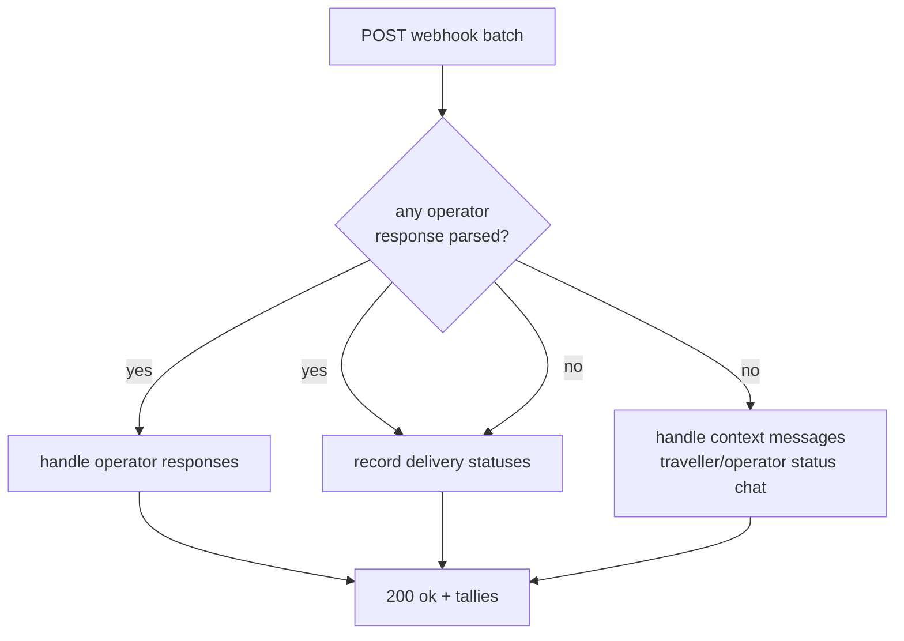
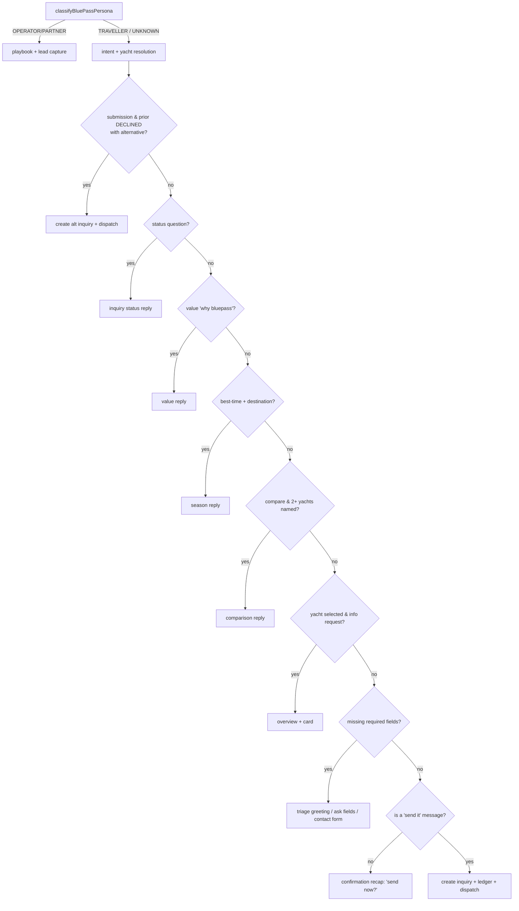
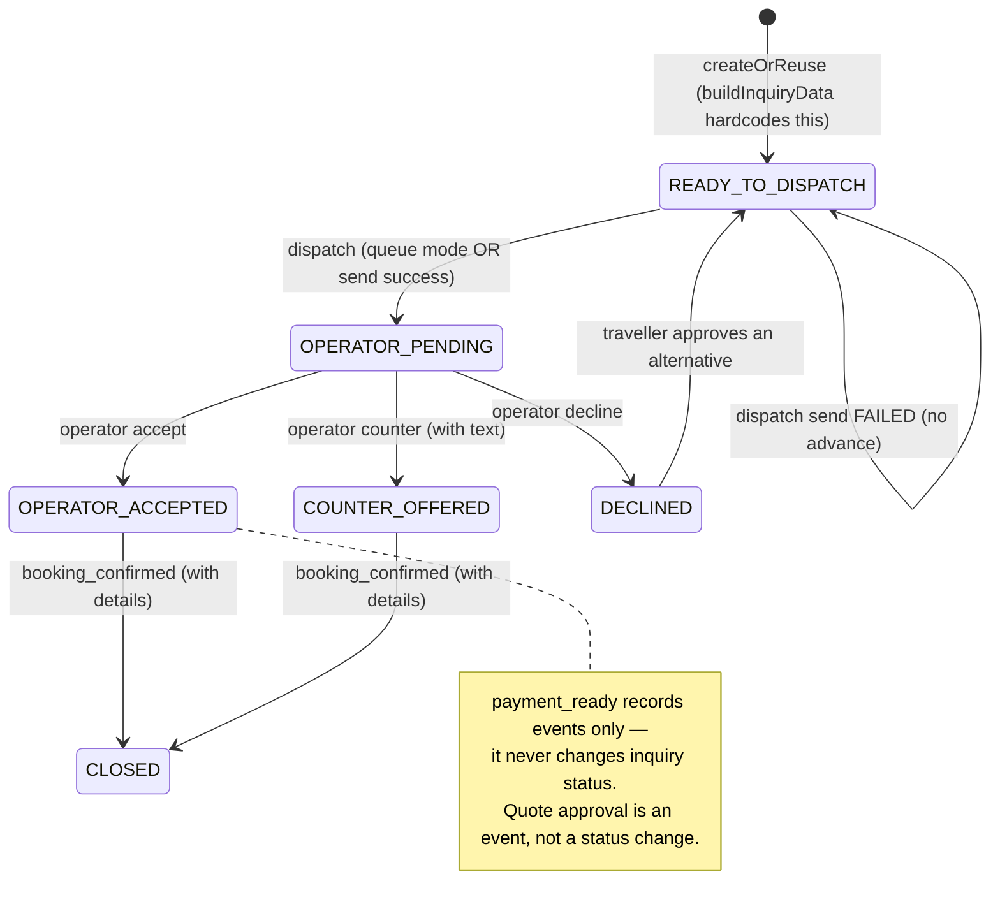

# Kai — triage & decision tree (developer reference)

> Exhaustive map of how Kai decides what to do on the BluePass marketplace surface:
> who it is talking to, what it says back, and how a message becomes an operator
> inquiry, a quote, and a booking.
>
> **Anchored to:** branch `tony/kai-test-all` @ `7b8057d`. Line numbers are from that
> commit — treat them as signposts, not contracts.
> **Companion docs:** `kai-persona-triage.md` (short overview), `bluepass/docs/kai-triage-decision-matrix.md`
> (the product spec / source of intent), `followup-engine.md`, `operator-knowledge-pack.md`.
> **Scope:** the BluePass persona/triage + marketplace decision logic. The generic
> tenant/PMS booking brain (widget availability, manual inquiries — see `kai-v1-test-flow.md`)
> is a separate layer and is only referenced where the two meet.

---

## Contents

1. [Orientation](#1-orientation)
2. [WhatsApp ingress & routing](#2-whatsapp-ingress--routing)
3. [Layer 0 — persona classification](#3-layer-0--persona-classification)
4. [Operator playbook](#4-operator-playbook)
5. [Partner playbook](#5-partner-playbook)
6. [Lead-capture terminal node](#6-lead-capture-terminal-node)
7. [Traveller decision tree](#7-traveller-decision-tree)
8. [Intent, required fields & yacht matching](#8-intent-required-fields--yacht-matching)
9. [Inquiry lifecycle & state machine](#9-inquiry-lifecycle--state-machine)
10. [Operator responses](#10-operator-responses)
11. [Quotes](#11-quotes)
12. [Referral & conservation ledger](#12-referral--conservation-ledger)
13. [Post-dispatch context messages](#13-post-dispatch-context-messages)
14. [WhatsApp delivery, 24h window & human takeover](#14-whatsapp-delivery-24h-window--human-takeover)
15. [Escalation, channel rules & the persona×intent matrix](#15-escalation-channel-rules--the-personaxintent-matrix)
16. [Implementation vs spec — gaps & divergences](#16-implementation-vs-spec--gaps--divergences)
17. [File map](#17-file-map)
18. [Worked examples](#18-worked-examples)

---

## 1. Orientation

**One brain, one database, many doors.** Every entry point funnels into a single
decision function and a single identity/inquiry store. The door a message comes
through (web widget, WhatsApp "kai" number, WhatsApp "ops" number) only decides
*routing*, never *identity* — a partner who books for a client, or an operator who
also plans a trip, is one graph of `Conversation` + `BluePassInquiry` rows.

```
web widget  ─┐
             ├─►  handleBluePassMarketplaceMessage()   ← the brain (deterministic)
WhatsApp   ──┘        src/server/bluepass/bluepass-message-flow.ts:54
```

**Two layers.** Kai is a generic tenant/PMS booking assistant *plus* a BluePass
marketplace layer on top. This document covers the BluePass layer.

**Fully deterministic on this branch.** There is **no LLM call anywhere in the triage
or marketplace path** — persona and intent are keyword/regex only. An LLM rewrite layer
exists elsewhere in the product but is gated off (`ENABLE_LLM`) and does not touch these
decisions. Everything below is exact and reproducible.

**Persona is re-derived every turn** from the full message history — no stored persona,
no schema flag. This makes it "sticky" (a persona established earlier survives later vague
messages) purely because history accumulates.

---

## 2. WhatsApp ingress & routing

`src/app/api/whatsapp/webhook/route.ts`

### GET — Meta verify handshake
Returns the raw `hub.challenge` with `200` **only when** `hub.mode === "subscribe"`
AND `hub.verify_token === process.env.WHATSAPP_WEBHOOK_VERIFY_TOKEN` AND a challenge is
present. Otherwise `403 { ok:false }`. (`route.ts:14-25`. Note: plain `===`, not a
timing-safe compare.)

### POST — event routing precedence
Three collections are pulled from the same webhook payload, but the **context gate** is
the key rule:

```
responses  = extractBluePassOperatorResponsesFromWhatsAppWebhook(payload)   // always
statuses   = extractWhatsAppMessageStatusesFromWebhook(payload)             // always
context    = responses.length === 0 ? extractWhatsAppInboundTextMessagesFromWebhook(payload) : []
```



- **Operator responses and statuses always run.** A single batch can both record a
  delivery status and process an operator reply.
- **Context (free-text) messages run only when zero operator responses were recognised.**
  So any `accept:/decline:/counter:` in the batch suppresses all context handling.
- Each collection has its own try/catch and tally (`handled`, `statusesHandled`,
  `contextHandled`) with separate failure arrays. POST **always** returns `200`.
- Bad JSON → `payload = null` → all extractors return empty → `200` with zero tallies.

### Operator-response classification
`src/server/whatsapp/webhook.ts` · `parseBluePassOperatorResponse`

Payload string is chosen by precedence:
`interactive.button_reply.id ?? button.payload ?? button.text ?? text.body`
(so a tapped quick-reply button and a typed string are parsed identically).

1. **Structured match** against `operatorResponsePattern`:
   ```
   /^(accept|decline|counter|payment_ready|payment-ready|booking_confirmed|booking-confirmed):([^\s]+)(?:\s+([\s\S]+))?$/i
   ```
   → `action` (normalised: lowercase, `-`→`_`), `inquiryId = match[2]`, `counterText = match[3]`.
2. **Keyword map** (`operatorTextActionMap`) on the whole trimmed payload (inquiryId = null):
   `accept, decline, counter, counter-offer→counter, payment ready/-/_→payment_ready,
   booking confirmed/-/_→booking_confirmed`.
3. **Natural-language heuristics**, first match wins (inquiryId = null, `counterText = payload`):
   `looksLikeBookingConfirmationDetails → booking_confirmed`,
   `looksLikePaymentReadyDetails → payment_ready`,
   `looksLikeCounterDetails → counter`,
   `looksLikeAcceptDetails → accept`,
   `looksLikeDeclineDetails → decline`. No match → `null` (ignored as an operator response).

<details><summary>Heuristic regexes (verbatim)</summary>

```
looksLikeAcceptDetails   = /\b(?:available|confirmed availability|can do|we can do|ok available|slot available)\b/  &&  !decline
looksLikeDeclineDetails  = /\b(?:not available|unavailable|full|sold out|fully booked|cannot|can't|no slot|no availability)\b/
looksLikeCounterDetails  = /\b(?:available|unavailable|instead|alternative|can do)\b/  &&  /\b(?:price|usd|\$|includes?|excludes?|deposit|condition)\b/
looksLikePaymentReadyDetails      = /\b(?:slot held|held|hold|slot on|payment link|pay ?link|pay here|payment url|balance due|payment path)\b/  &&  /\b(?:booking reference|reference|ref|confirm(?:ation)?|payment|pay|deposit|balance)\b/
looksLikeBookingConfirmationDetails = /\b(?:booking confirmed|confirmed booking|reservation confirmed|confirmed|booking ok|booking okay|booking done)\b/  &&  /\b(?:payment received|payment done|paid|booking reference|reference|ref|confirmation number)\b/
```
</details>

### Send side — kai vs ops number
`src/server/whatsapp/client.ts` · `resolveWhatsAppPhoneId(role)`
- role `"kai"` → `WHATSAPP_PHONE_ID_KAI` (throws if unset).
- role `"ops"` → `WHATSAPP_PHONE_ID_OPS`, falling back to `WHATSAPP_PHONE_ID_KAI`, else throws.
- All sends POST to `https://graph.facebook.com/${META_GRAPH_VERSION}/${phoneId}/messages`
  with `WHATSAPP_ACCESS_TOKEN` (Bearer), 10s abort. `normalizeRecipientPhone` strips to
  digits and rewrites a leading `0` to the Indonesia `62` prefix.

> The code already supports a two-number topology (customer "kai" line + operator/partner
> "ops" line). Inbound disambiguation today is by payload shape (see the context gate); a
> dedicated ops number makes operator-reply routing unambiguous.

---

## 3. Layer 0 — persona classification

`src/core/bluepass/triage.ts` · `classifyBluePassPersona(messages)` (`:132-141`)

Lowercase the whole joined history, then check **in order — first match wins**:

```
1. partnerSignals   → PARTNER
2. operatorSignals  → OPERATOR
3. travellerSignals → TRAVELLER
4. (none)           → UNKNOWN
```

**Partner is checked before operator on purpose:** "I run a dive shop" is a PARTNER
(shops refer; they don't operate boats). Bare `"partner"` and bare `"referral"` are
deliberately *not* signals (romantic "my partner", pasted referral codes).

<details><summary>partnerSignals (verbatim, checked 1st)</summary>

```
dive shop · travel agen · tour agen · booking agen · i'm an agent · im an agent ·
refer or book for clients · refer clients · refer my clients · i refer · my clients ·
my audience · i'm a creator · im a creator · content creator · influencer · trip leader ·
dive club · book for clients · on behalf of clients · referral link · referral commission ·
referral partner · partner program · become a partner · how do commissions work · commission
```
</details>

<details><summary>operatorSignals (verbatim, checked 2nd)</summary>

```
i run trips · run trips or charters · i run a · i run an · i run the · i run boats ·
i run dive · we run · we operate · i operate · i own a · i own an · our fleet · our boats ·
our yacht · our liveaboard · my liveaboard · my dive centre · my dive center · my dive resort ·
list my business · list our · list my boat · claim my · claim our · i'm an operator ·
im an operator · as an operator · join as an operator
```
</details>

<details><summary>travellerSignals (verbatim, checked 3rd)</summary>

```
planning a trip · komodo · raja ampat · labuan bajo · liveaboard · dive · snorkel · sail ·
surf · manta · honeymoon · holiday · vacation · yacht · cabin · charter
```
</details>

### Triage greeting (UNKNOWN, no signal)
`buildBluePassTriageGreeting()` (`:148`) fires via `shouldSendBluePassTriageGreeting` when:

```
persona === "UNKNOWN"  &&  !hasIntentSignal  &&  missingFields.length > 0
```

Greeting: *"Hey - Kai here, the BluePass concierge. Quick one so I point you the right way:
are you planning a trip, do you run boats or dive trips, or do you book and refer for
clients?"* The three options ride inside the sentence — **this path has no suggestion
chips** (`BluePassPersonaReply` carries only `reply` + optional `showCatalog`/`catalogDestination`).

---

## 4. Operator playbook

`buildBluePassOperatorReply({ latestMessage, pitched })` (`triage.ts:195-262`).
Ordered `has(...)` keyword chain, **first match wins**, then a `pitched` fallback, then a default.

| # | Trigger keywords | Reply |
|---|---|---|
| 1 | `18`, `break down`, `breakdown`, `fee`, `cut`, `take rate`, `commission` | The 18% breakdown; operator keeps 82% |
| 2 | `what do we get/i get`, `why join`, `benefit`, `what's included`, `why bluepass` | Benefits (page, web+WhatsApp inquiries, Kai pre-qualifies guests, partner network, conservation) |
| 3 | `outside`, `not in indonesia`, `add us to the list` | Expansion-list capture (Indonesia-first) |
| 4 | `indonesia` | Pre-built page / claim-link path |
| 5 | `vet`, `green fins`, `approval`, `requirement`, `qualify` | Vetting; approval is a team decision (never promised) |
| 6 | `payout`, `paid out`, `get paid`, `contract`, `bank` | "For the humans" → human handoff |
| 7 | `claim` | Claim-link path |
| 8 | *(pitched already)* | "Happy to go deeper" |
| 9 | *(default)* | "We're onboarding operators now…" 82/18 pitch |

`pitched = classifyBluePassPersona(priorTravellerMessages) === persona` — i.e. was this
persona already established *before* the current message.

---

## 5. Partner playbook

`buildBluePassPartnerReply({ latestMessage, pitched })` (`triage.ts:266-347`). Same
first-match-wins shape. Branches with `showCatalog` attach up to 2 preview yacht cards.

| # | Trigger keywords | Reply | showCatalog |
|---|---|---|---|
| 1 | `komodo` | Komodo brief | ✓ (Komodo) |
| 2 | `raja ampat`, `raja` | Raja Ampat brief | ✓ (Raja Ampat) |
| 3 | `conservation`, `impact`, `reef`, `5%` | Conservation / co-brandable impact | — |
| 4 | `commission`, `earn`, `percent`, `my cut`, `%` | Commission mechanics (funded from operator side, no client markup) | — |
| 5 | `catalogue`, `catalog`, `which operators`, `what boats`, `inventory` | Catalogue | ✓ |
| 6 | `founding`, `terms`, `lock` | Founding-partner terms | — |
| 7 | `claim`, `link` | Claim-link path | — |
| 8 | `book for a client`, `book a trip for`, `on behalf`, `book now`, `dates are set` | Book-on-behalf | — |
| 9 | *(pitched)* | "Whatever's most useful" | — |
| 10 | *(default)* | Partner pitch | — |

---

## 5a. Level-2 FAQ branches (added via the refinement loop)

The core tables above are the original spine. Since then, many **level-2 FAQ branches**
have been layered in ahead of the `pitched`/default fallbacks (still first-match-wins,
each ≤320 chars, each ending in a same-track capture CTA). Keyword lists live in
`triage.ts`; this is the intent inventory (line numbers intentionally omitted — they drift).

**Operator** — set-own-price · no-pay-per-lead · what's-the-catch · won't-undercut-your-price ·
page-build requirements (low lift) · demo/example page · multi-listing / whole fleet ·
PMS integration (Rezdy/FareHarbor/Bokun) · where-bookings-come-from · demand-expectation
(no guarantee, honest) · inquiry→handoff · guest-support split (you run the trip) ·
data/privacy · cancellation/refund (your terms) · pause / no-lock-in · timeline (no promise) ·
license / Green Fins vetting · language / Bahasa (no English needed) · how-guests-pay
(secure checkout) · manage-on-phone (no app) · availability / calendar control ·
reviews/ratings (earned) · competitors / differentiation · OTA differentiation (not exclusive) ·
operator references / social-proof (honest, none invented) · is-BluePass-legit · sign-up steps ·
talk-to-a-real-person / book-a-call.

**Partner** — regions (Indonesia-first) · co-brand / white-label · attribution / 60-day window ·
marketing assets · group / charter · minimum-volume (none) · go-live-fast · bookings/earnings
dashboard · cost-to-join (none) · payout mechanics · creator-no-clients · is-BluePass-legit ·
how-to-refer (tracked link) · refer-operators (honest, team-set terms) · currency / conversion ·
API / embed (honest, no overpromise) · client-ownership / no-poaching · trip-type scope ·
partner social-proof · ballpark-commission refusal (no invented number) · markup refusal
(operator-direct rate) · client pays no booking fee · operator-cancels (team steps in) ·
setup support · talk-to-a-real-person / book-a-call · demo/example page.

**Invariant guards** (in `triage.test.ts`): no-dead-end CTA (every reply invites a next step) ·
≤320-char concise ceiling (full input battery) · track-lock first-signal-wins (incl.
operator-vs-partner contests) · persona-framing guards (no "82%" in a partner reply; no
partner-only framing in an operator reply) · degenerate-input fuzz safety · substring-collision
routing traps (e.g. "under**cut**" ≠ 18% branch, "**star**t" ≠ reviews).

---

## 6. Lead-capture terminal node

Nested inside the OPERATOR/PARTNER branch (`bluepass-message-flow.ts:67-86`). It
**outranks every keyword branch** — the moment the *latest* message contains a reachable
channel, Kai captures and acknowledges instead of continuing the playbook.

```
IF leadHasReachableChannel(extractBluePassLead([latest message]))     // email or phone present
   lead = mergeBluePassLead(extractBluePassLead(prior), latest)
   upsertBluePassPersonaLead(...)          // best-effort; DB failure is swallowed
   reply = buildBluePassLeadCapturedReply({ persona, lead })   // echoes captured fields back
```

Persistence (`upsertBluePassPersonaLead`, `bluepass-inquiry-repository.ts:1872`): reuses
the `BluePassInquiry` table with `tripType` = `OPERATOR_LEAD` | `PARTNER_LEAD`, status
`DRAFT`, one row per conversation (later details merge in). Emits `PERSONA_LEAD_CREATED` /
`PERSONA_LEAD_UPDATED`. Persona leads never enter dispatch/quote.

---

## 7. Traveller decision tree

The spine: `handleBluePassMarketplaceMessage` (`bluepass-message-flow.ts:54`). Reached
when persona is TRAVELLER **or** UNKNOWN (fell through the operator/partner short-circuit).
Branches evaluate top-to-bottom, **first match wins**.



| # | Guard (first match wins) | Outcome | Ref |
|---|---|---|---|
| PRE | — | Extract intent (history+message), resolve selected yacht across the thread, back-fill destination from yacht region, compute `bluepassMatches` | `:103-112` |
| 1 | `isBluePassInquirySubmissionRequest` AND latest inquiry `DECLINED` AND an alternative yacht exists | Auto-create the alternative inquiry (carries prior fields + referral, `alternativeOf.reason="operator_declined"`), sync ledger, dispatch if operator phone | `:114-178` |
| 2 | `isBluePassInquiryStatusQuestion` | Active-inquiry status reply, or fixed "no active inquiry" string | `:180-204` |
| 3 | `isBluePassValueQuestion` | Fixed "why BluePass" paragraph | `:206-208` |
| 4 | `resolveSeasonDestination` non-null (timing phrase + destination) | Season reply (Raja Ampat Oct–Apr, else Komodo Apr–Nov) | `:210-213` |
| 5 | `isBluePassYachtComparisonRequest` AND ≥2 yachts named **in this message** | Comparison rows + Komodo-vs-Raja contrast (no cards) | `:215-217` |
| 6 | `selectedYacht` AND `isBluePassYachtInformationRequest` (asks-for-info AND NOT commercial-action) | Overview reply + single card | `:219-223` |
| 7 | `missingFields.length > 0` | **7a** triage greeting if UNKNOWN+no-signal; else **7b** ask missing trip fields, surface `CONTACT_DETAILS_REQUIRED` form when only contact fields remain | `:225-265` |
| 8 | `missingFields.length === 0` AND NOT a submission message | Confirmation recap: *"should I send this inquiry now?"* (no DB write) | `:267-284` |
| 9 | `missingFields.length === 0` AND `isBluePassInquirySubmissionRequest` | Create inquiry → sync ledger → dispatch operator (if phone) → "sent, not yet confirmed" reply | `:286-317` |

Branch 8 is the deliberate **human-in-the-loop gate**: even with every field known, Kai
never submits until the traveller affirms.

<details><summary>Guard regexes (verbatim)</summary>

```
isBluePassInquirySubmissionRequest (any of):
  /^(?:yes|yep|yeah|ok|okay|sure|please|yes please|go ahead|proceed|confirm|confirmed)[.! ]*$/   (trimmed)
  /\b(?:send|submit|create|prepare)\s+(?:this\s+|the\s+|an?\s+)?(?:operator\s+)?inquir(?:y|ies)\b/
  /\b(?:send|submit)\s+(?:this|it|that)\s+(?:to\s+the\s+)?operator\b/
  /\b(?:yes|yep|yeah|ok|okay|sure|confirm|confirmed|go ahead|proceed)\b.*\b(?:send|submit|inquiry|operator|it|this)\b/

isBluePassValueQuestion (any of):
  /\b(?:why|how)\s+(?:should\s+i\s+)?(?:use|book\s+with|choose)\s+bluepass\b/
  /\b(?:why|how)\s+bluepass\b/
  /\b(?:booking direct|book direct|direct booking|same price|conservation|give back|5%)\b/

isBluePassInquiryStatusQuestion:
  /\b(?:status|update|operator replied|operator response|confirmed yet|any news|what happened)\b/i

isBluePassYachtComparisonRequest:
  /\b(?:compare|versus|vs\.?|difference|which is better)\b/i

isBluePassYachtInformationRequest:
  asksForInformation = /\b(?:tell me about|what is|what's|explain|describe|info about|learn about|details about)\b/  ||  /\?$/
  asksForCommercialAction = /\b(?:send|create|prepare|make|start|submit)\s+(?:an?\s+)?inquir(?:y|ies)\b/  ||  /\b(?:check|confirm)\s+(?:live\s+)?availability\b/  ||  /\b(?:book|booking|reserve|hold|quote|operator|whatsapp|proceed)\b/
  → asksForInformation && !asksForCommercialAction

resolveSeasonDestination:
  asksTiming = /\b(?:best|good|ideal|recommended)\s+(?:time|season|month)\b/  ||  /\bwhen\s+(?:is\s+)?(?:the\s+)?best\b/
  → 'Raja Ampat' if /\b(?:raja\s+ampat|misool|sorong|wayag)\b/ ; 'Komodo' if /\b(?:komodo|labuan\s+bajo|flores)\b/ ; else null
```
</details>

---

## 8. Intent, required fields & yacht matching

### Intent extraction — `src/core/bluepass/intent.ts`
`BluePassInquiryIntent`: `destination, tripType, dateWindow, guests, budget, travellerName,
travellerEmail, travellerPhone, selectedYachtSlug, interests[]`.

<details><summary>Extraction regexes (verbatim)</summary>

```
destination : /\b(?:komodo|labuan\s+bajo|flores)\b/i → "Komodo" ; /\braja\s+ampat\b/i → "Raja Ampat"
interests   : /\b(dive|diving)\b/i → dive ; /\b(private|charter)\b/i → private ; /\bcabin\b/i → cabin
guests      : /\b(\d{1,3})\s*(?:guests?|people|pax|travellers?|travelers?)\b/i
budget      : /\b(?:USD\s*)?(\$?\s?\d{3,7}(?:,\d{3})?)(?:\s*USD)?\b/i  (gated by budget|around|usd|$ within 20 chars before)
email       : /[A-Z0-9._%+-]+@[A-Z0-9.-]+\.[A-Z]{2,}/i
phone       : /\b(?:phone|whatsapp|wa)(?:\s+number)?\s*(?:is|:)?\s*([+\d][\d\s().-]{6,})/i
name        : /\b(?:my name is|name is|i am|i'm)\s+([A-Za-z][A-Za-z' -]{1,60})(?=,|\.|$|\s+(?:email|phone|whatsapp)\b)/i
date window : "next month" | "tomorrow" | "next week" | day-month | month-day | bare month
```
</details>

**Required fields** (missing = undefined/null/empty): `destination, dateWindow, guests,
travellerName, travellerEmail, travellerPhone`. `shouldRequestContactForm` returns true —
surfacing the `CONTACT_DETAILS_REQUIRED` form (`fields: [name, email, phone]`) — only when
*every* remaining missing field is a contact field (trip details already complete).

### Yacht matching
`searchBluePassYachts` (`catalog.ts`) additive scoring, sort by score then `maxGuests`, top 3:
```
selected slug match +100 · destination region match +40 · guests fit +20 · each interest +10
score 0 → "preview BluePass catalog option"
```
`resolveMentionedYachts` (name/slug in message): exact name 100, slug 95, all multi-word
name-words fuzzy (Levenshtein ≤2, min 5 chars) `60 + words*5`; single-word names never fuzzy.

Preview catalog (`bluePassPreviewCatalog`): `alila-purnama` (Komodo, Legend, 10),
`alexa` (Komodo, Premium, 2), `calico-jack` (Komodo, Premium, 10),
`aliikai` (Raja Ampat, Premium, 15), `amandira` (Raja Ampat, Legend, 10). Regions are
exactly `"Komodo"` and `"Raja Ampat"`. **On the WhatsApp path the flow gets no external
catalog or referral**, so it falls back to this preview catalog and `referral: null`.

---

## 9. Inquiry lifecycle & state machine

`BluePassInquiryStatus`: `DRAFT · READY_TO_DISPATCH · OPERATOR_PENDING · OPERATOR_ACCEPTED ·
COUNTER_OFFERED · DECLINED · CLOSED`.



- **`createOrReuseBluePassInquiry`** reuses an active inquiry (`DRAFT, READY_TO_DISPATCH,
  OPERATOR_PENDING, COUNTER_OFFERED`) for the conversation, else creates. Both paths end at
  `READY_TO_DISPATCH` (`buildInquiryData` hardcodes it). Emits `INQUIRY_CREATED`/`INQUIRY_UPDATED`.
- **Operator phone resolution** (first match wins): forced test phone (non-prod +
  `BLUEPASS_FORCE_TEST_OPERATOR_PHONE`) → operator-directory lookup → `BLUEPASS_OPERATOR_PHONE_OVERRIDES`
  JSON → `selectedYacht.operatorPhone` → existing inquiry phone → null. Preview-catalog phones
  (`/^6281234567\d+$/`) are suppressed in production.
- **Dispatch send mode** (`WHATSAPP_OPERATOR_INQUIRY_SEND_MODE`): `template` → template with
  quick-reply buttons; `text` → plain text; **anything else → `queue` (no message sent)**.
  A `BluePassOperatorDispatch` row is always written `QUEUED` first. On `queue` or send success
  the inquiry advances to `OPERATOR_PENDING`; on send failure it stays put and emits
  `OPERATOR_DISPATCH_FAILED`.

> **Operational gotcha:** the default send mode is `queue`, which writes the dispatch row and
> advances status **but sends no WhatsApp**. Operators only actually receive the message when
> the env is set to `template` (with the approved `booking_inquiry_operator` template) or `text`.

---

## 10. Operator responses

`handleBluePassOperatorResponse` (`bluepass-inquiry-repository.ts:364`). Action routing,
first match wins:

1. `counter` **with empty text** → `requestOperatorCounterDetails` (emit
   `OPERATOR_COUNTER_DETAILS_REQUESTED`, prompt operator for details; no status change).
2. `payment_ready` → gated handler (below).
3. `booking_confirmed` → gated handler (below).
4. `accept` | `decline` | `counter`-with-text → set status
   (`OPERATOR_ACCEPTED` | `DECLINED` | `COUNTER_OFFERED`), emit event, **draft a quote for
   accept/counter**, notify the traveller (accept says "not confirmed yet"; decline appends
   alternatives; counter includes the details).

- **payment_ready** (`:1223`): requires payment text AND `quote.status === "TRAVELLER_APPROVED"`,
  else emits `..._IGNORED` / `..._WAITING_FOR_TRAVELLER_APPROVAL` and stops. **Never changes
  inquiry status** — records events and notifies the traveller.
- **booking_confirmed** (`:1308`): requires confirmation text; sets status → **`CLOSED`**,
  notifies traveller. This is the only action that closes an inquiry.
- **Operator reply with no inquiry id** → `resolveLatestPendingBluePassInquiryIdForOperatorPhone`
  matches the most recent dispatch to that operator phone whose inquiry is in
  `READY_TO_DISPATCH, OPERATOR_PENDING, OPERATOR_ACCEPTED, COUNTER_OFFERED`.

---

## 11. Quotes

`src/server/bluepass/bluepass-quote.ts`. **Quotes are not a table** — they are assembled
from `BluePassInquiryEvent` rows and keyed by the inquiry id (`quoteId === inquiryId`).

- **Draft** on operator `accept`/`counter` (`createBluePassQuoteDraftForOperatorResponse`):
  accept parses price from `inquiry.budget`; counter parses price/date/inclusions/exclusions/terms
  from the counter text. Stored as `BLUEPASS_QUOTE_DRAFTED`.
  `quote.status = price ? "READY_FOR_TRAVELLER" : "NEEDS_FINAL_PRICE"`. A **quote-local** 5%
  `conservationContributionCents = round(grossPriceCents * 0.05)` is computed here (distinct
  from the ledger's 5%).
- **Approve** (`approveBluePassQuote`): writes `BLUEPASS_QUOTE_APPROVED`, notifies operator +
  traveller. **Does not change inquiry status** — it only unlocks the payment_ready gate
  (quote status becomes `TRAVELLER_APPROVED`).
- **Statuses:** `NEEDS_FINAL_PRICE → READY_FOR_TRAVELLER → TRAVELLER_APPROVED`; operational
  overlay `PAYMENT_READY → BOOKING_CONFIRMED` derived from events.

---

## 12. Referral & conservation ledger

`src/core/bluepass/ledger.ts` · `calculateBluePassLedgerEstimate` /
`syncBluePassReferralLedgerEstimate` (`bluepass-inquiry-repository.ts:138`, idempotent —
clears prior `PENDING` rows and re-inserts).

> **⚠ This is NOT the "5/5/3/5" split from the product spec / memory.** The actual constants:

```
conservationPct = 0.05        // 5% of budget
commissionPct   = 0.15        // 15% of budget …
commissionCapUsd = 750        //   … capped at USD 750
creatorSharePct = 0.30        // creator gets 30% OF the commission (only if referralRole==='CREATOR')

commission   = min(budget*0.15, 750)
conservation = budget*0.05
creatorShare = referralRole==='CREATOR' ? commission*0.30 : 0
bluepassNet  = commission - creatorShare
operatorNet  = max(0, budget - commission - conservation)
```

- **Gated on a referral:** if `!referralPartnerId`, `calculateBluePassLedgerEstimate` returns
  `[]` — no ledger entries at all.
- Emits four `BluePassLedgerEntry` rows (kinds `CREATOR_COMMISSION_ESTIMATE`,
  `BLUEPASS_PLATFORM_COMMISSION`, `CONSERVATION_ALLOCATION`, `OPERATOR_PAYOUT_PLACEHOLDER`),
  status `PENDING`, currency `USD`. `parseBudgetUsd` only matches 2–7 digit runs; otherwise 0
  (→ zero-value entries).

See [gaps](#16-implementation-vs-spec--gaps--divergences) — reconcile the split with the
business model before it drives real payouts.

---

## 13. Post-dispatch context messages

When a batch has **no** operator response, free-text inbound is handled as a "context
message" (`handleBluePassWhatsAppContextMessage`, `:520`) — a status-aware conversational
reply for whoever is already in a thread.

- **Participant resolution** (operator wins over traveller): most-recent dispatch phone match
  → `operator`; else a `BluePassInquiry.travellerPhone` match → `traveller`; else no context →
  `{ handled:false }`. Phone candidates include Indonesia local (`62`→`0`) and international
  (`0`→`62`) variants.
- **Traveller on a DECLINED inquiry** who approves an alternative → auto-creates + dispatches
  the alternative (`sourceChannel: "WHATSAPP"`).
- **Status-aware replies** (first match wins) differ per participant — e.g. operator sees
  "traveller approved; hold slot + send payment link" when a quote is approved; traveller sees
  "operator accepted, not confirmed yet" on `OPERATOR_ACCEPTED`. Reply sent via role
  `ops` (operator) or `kai` (traveller). Emits `WHATSAPP_CONTEXT_MESSAGE_RECEIVED` then
  `..._REPLY_SENT`/`..._REPLY_FAILED`.

---

## 14. WhatsApp delivery, 24h window & human takeover

- **Traveller notify mode** (`resolveTravellerWhatsAppNotificationMode`): `text`/`template`
  honoured; unset defaults to `text` when `WHATSAPP_ACCESS_TOKEN` + `WHATSAPP_PHONE_ID_KAI` +
  `META_GRAPH_VERSION` are all set, else `disabled` (records `..._SKIPPED`).
- **24h re-engagement fallback:** a `text` send that fails with Meta code `131047` /
  "re-engagement" is retried as a `template` send (also handled from delivery-status webhooks:
  `recordBluePassTravellerWhatsAppDeliveryStatus`).
- **Human takeover is binary and gates the whole concierge:** in the traveller WhatsApp flow,
  if `conversation.controlMode !== "AI"` the inbound turn is persisted and the flow is **not
  run**. `markBluePassWhatsAppHumanTakeover` sets `controlMode: "HUMAN"` — driven by the
  Business-app coexistence echo (a human answering from the phone app).

---

## 15. Escalation, channel rules & the persona×intent matrix

From the product spec (`bluepass/docs/kai-triage-decision-matrix.md`) — the intended
behaviour the code implements against.

**Persona × intent → action (summary):**

| Intent ↓ / Persona → | TRAVELLER | OPERATOR | PARTNER | UNKNOWN |
|---|---|---|---|---|
| Greeting / vague | Trip-shaping | Qualify business | Qualify partner | **Triage question** |
| Trip questions | Match → operator rec | Answer, pivot to "your guests get this" | Answer for their client, frame via referral | Answer + infer traveller |
| Pricing | Cabin/charter tiers | 82/18 economics | Commission mechanism | Answer + triage |
| "How do I join?" | Sign-up nudge | Claim/vetting path | Claim/founding path | Triage first |
| Ready to transact | Human handoff (inquiry) | Capture + team | Book-on-behalf + team | Triage |
| Complaint / safety / legal / refunds | **Human handoff (all personas)** | | | |
| Conservation | 5% story | Co-brandable impact | Co-brandable assets | 5% + triage |

**Silent-inference & switching:** classify silently when the first message already reveals
the persona; one triage question max, then default to TRAVELLER; honour a mid-conversation
persona switch immediately, keeping context.

**Escalation / human handoff triggers:** booking/payment intent · payout/contract/commission
negotiation · safety/medical/legal/insurance/refunds · past-trip complaints · specific
availability · anything Kai would have to invent. Handoff = capture a reachable channel +
say what happens next + audit-log; never a dead end.

**Channel rules:** WhatsApp ≤ ~600 chars, one link max, no markdown headers, inside the 24h
window; web uses 1–3 short paragraphs with the tree's next branches as chips; mirror the
user's language (Bahasa Indonesia expected from operators).

---

## 16. Implementation vs spec — gaps & divergences

Read this before assuming the code matches the pitch.

1. **Ledger split ≠ 5/5/3/5.** Code = 5% conservation + 15% commission (cap USD 750) +
   30%-of-commission creator share, referral-gated; no explicit 3% payments / 5% platform
   lines. Reconcile before real payouts. (`ledger.ts:30-46`)
2. **Two independent 5% conservation calcs** — the ledger `CONSERVATION_ALLOCATION`
   (referral-gated) and the quote's `conservationContributionCents` (always, when a price is
   parsed). They can disagree.
3. **Fully deterministic — no LLM** on the triage/marketplace path. Persona and intent are
   keyword/regex; an LLM classifier is a future layer, not present here.
4. **Default dispatch send mode is `queue` = nothing sent.** Operators receive nothing until
   `WHATSAPP_OPERATOR_INQUIRY_SEND_MODE` is `template`/`text`.
5. **No one-tap / interactive buttons on the live WhatsApp traveller path.** The context-message
   path sends plain text; yacht cards flatten to text lines and `contactRequest` is dropped.
   (Open PRs #2/#3 add traveller inbound + one-tap interactive buttons but were authored against
   a different webhook shape than this branch's context-message approach — reconcile before merge.)
6. **Payment is operator-attested, not collected.** `booking_confirmed` closes the inquiry on
   the operator's word; there is no purchase link / payment capture in this flow. This is the
   critical commercial gap (the marketplace-payment work).
7. **Quotes and persona-leads reuse `BluePassInquiry`/events** rather than dedicated tables —
   fine for now, flagged for when volume justifies a schema.
8. **Traveller quote approval does not move inquiry status** — it only adds an event that
   unlocks the payment_ready gate. Status advances only on explicit operator actions.

---

## 17. File map

| Concern | File |
|---|---|
| WhatsApp webhook (routing precedence) | `src/app/api/whatsapp/webhook/route.ts` |
| Webhook parse/extract (operator/inbound/status) | `src/server/whatsapp/webhook.ts` |
| Graph send client (kai/ops roles) | `src/server/whatsapp/client.ts` |
| Operator template + free-text builders | `src/server/whatsapp/operator-dispatch.ts`, `templates.ts` |
| Persona classify + operator/partner playbooks + lead-captured reply | `src/core/bluepass/triage.ts` |
| Lead extraction | `src/core/bluepass/lead.ts` |
| Traveller reply builders | `src/core/bluepass/reply.ts` |
| Intent extraction + required fields | `src/core/bluepass/intent.ts` |
| Yacht catalog + matching/scoring | `src/core/bluepass/catalog.ts` |
| Marketplace decision spine | `src/server/bluepass/bluepass-message-flow.ts` |
| WhatsApp traveller flow + human takeover | `src/server/bluepass/bluepass-whatsapp-flow.ts` |
| Inquiry lifecycle, dispatch, operator responses, context, notify | `src/server/bluepass/bluepass-inquiry-repository.ts` |
| Operator directory lookup | `src/server/bluepass/bluepass-operator-directory.ts` |
| Quote assembly/approval | `src/server/bluepass/bluepass-quote.ts` |
| Referral/conservation ledger | `src/core/bluepass/ledger.ts` |
| Operator dispatch text | `src/core/bluepass/dispatch.ts` |

---

## 18. Worked examples

**A. Cold traveller (WhatsApp, unknown number)**
`"hi"` → UNKNOWN, no signal → branch 7a **triage greeting**. →
`"3 of us want to dive Komodo in March"` → TRAVELLER; intent destination=Komodo, guests=3,
date=March; still missing name/email/phone → branch 7b asks for them (contact form). →
contact details given → branch 8 **confirmation recap**. → `"yes send it"` → branch 9
**create inquiry → dispatch operator** (if send mode set) → "sent, not confirmed yet".

**B. Operator onboarding (WhatsApp)**
`"I run a liveaboard in Komodo, what's your cut?"` → OPERATOR (operatorSignals) → playbook
branch 1 **18% breakdown**. → `"ok, ops@boat.com"` → **lead-capture terminal node** →
`OPERATOR_LEAD` row + acknowledgement echoing the captured email.

**C. Operator accepts → booking**
Operator taps **Accept** (or texts `accept:<id>`) → status `OPERATOR_ACCEPTED`, **quote
drafted** from budget, traveller notified. → traveller approves the quote →
`BLUEPASS_QUOTE_APPROVED` (status unchanged). → operator sends `payment_ready` **with a
payment link** → allowed (quote approved) → traveller notified. → operator sends
`booking_confirmed <ref>` → status **`CLOSED`**, traveller notified.

---

*Generated from a read of the code at `tony/kai-test-all` @ `7b8057d`. When the code moves,
re-verify the line numbers and the two things most likely to drift: the ledger split
(§12/§16) and the WhatsApp inbound shape (§2 vs open PRs #2/#3).*
